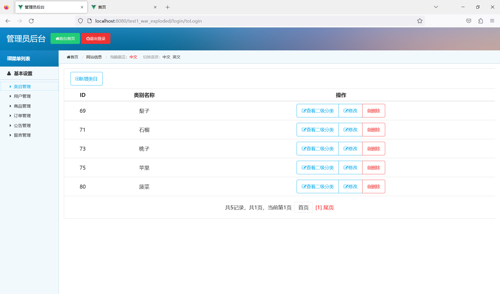
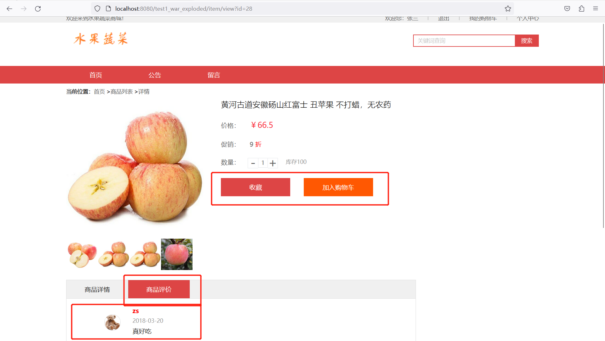
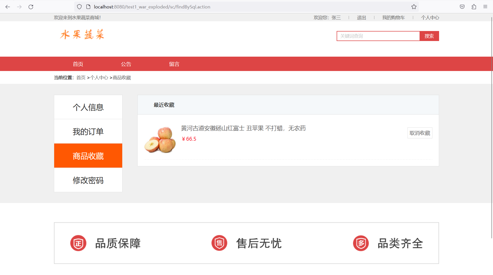
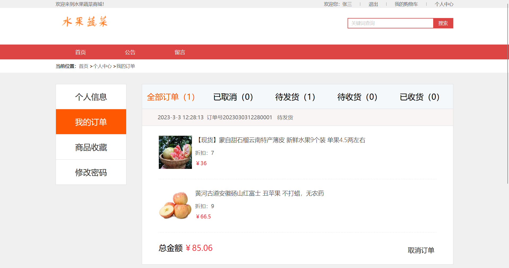
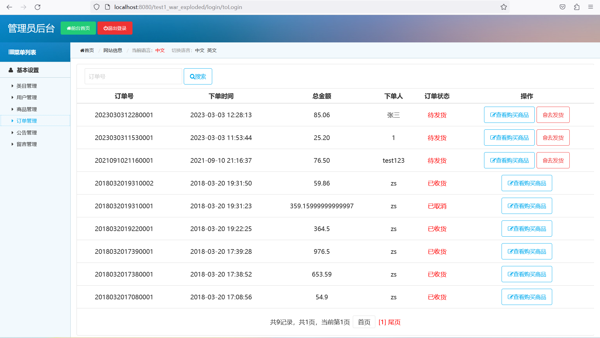
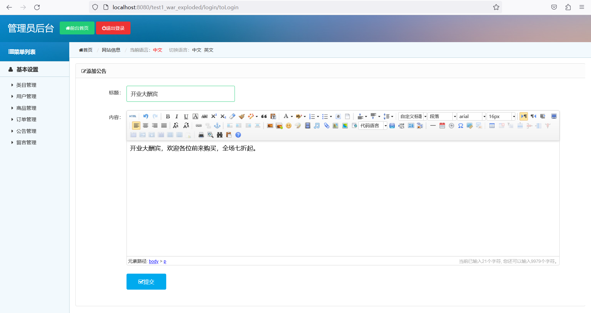
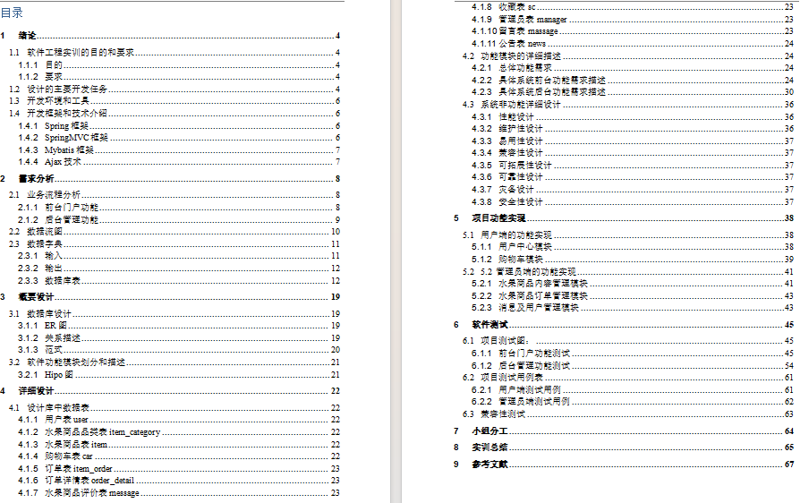
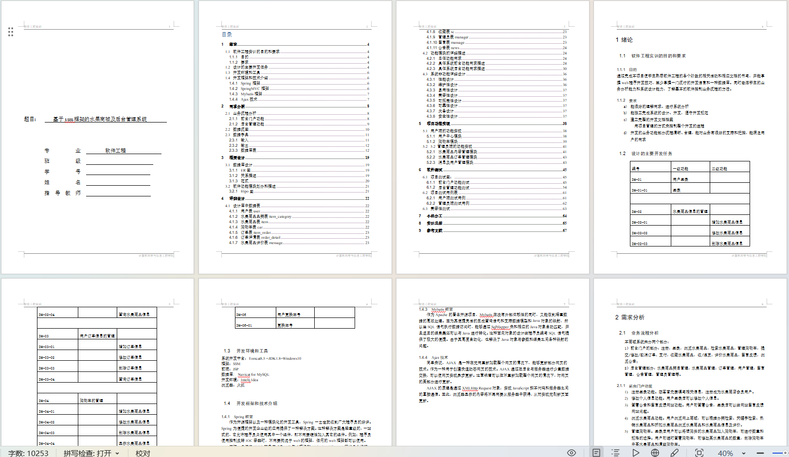

# 水果商城

### 一、介绍

java+jsp

基于Spring+SpringMVC+Mybatis的水果商城

开发语言：java

数据库:mysql

### 完整项目获取

通过网盘分享的文件：水果蔬菜商城系统

链接: https://pan.baidu.com/s/16pfNx7AXE-BqlrP1WLxFKw?pwd=mvch 提取码: mvch
--来自百度网盘超级会员v3的分享

通过网盘分享的文件：工具包

链接: https://pan.baidu.com/s/1YmdoJvkjoUjA75wvHLDZ6A?pwd=xm96 提取码: xm96
--来自百度网盘超级会员v3的分享

通过网盘分享的文件：远程调试部署联系方式

链接: https://pan.baidu.com/s/1W0dDcoZmayG0c7USJDYBYg?pwd=nqd7 提取码: nqd7
--来自百度网盘超级会员v3的分享

### 二、本项目分为前后台，有管理员与用户两种角色；

#### 1、管理员角色包含以下功能：

六大功能模块：类目管理、用户管理、商品管理、订单管理、公告管理、评论管理

#### 2、用户角色包含以下功能：

1、用户登录/注册 2、查看首页 3、查看商品详情 4、查看购物车 5、提交订单 6、修改个人信息 7、修改密码 8、查看我的订单 9、添加配送地址 10、查看收藏夹等功能 11、搜索商品 12、查看公告 13、评论留言 14、商品收藏

### 三、用户功能部分页面展示

### 四、管理员功能部分页面展示

### 五、一万字论文参考

